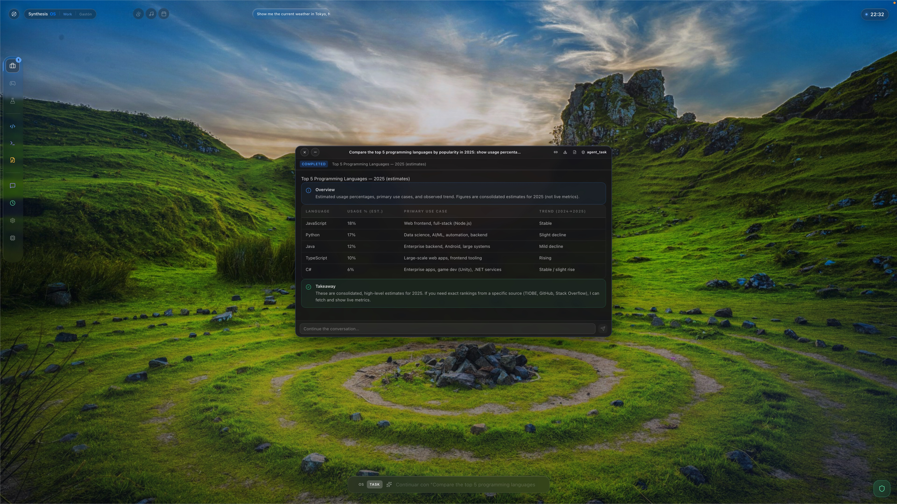
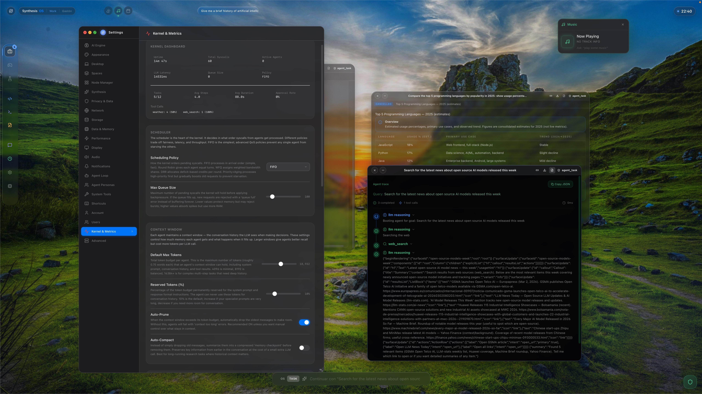
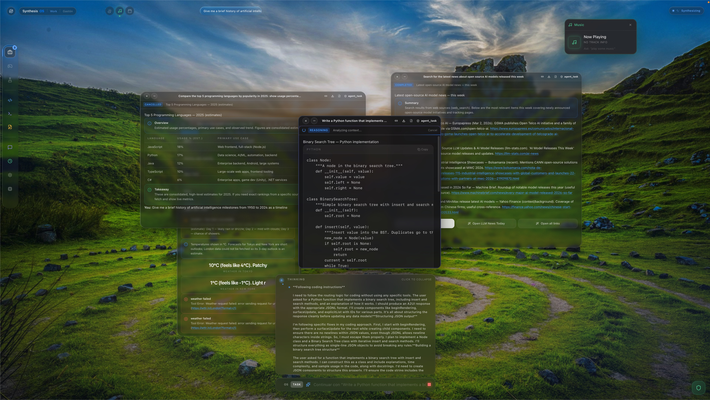
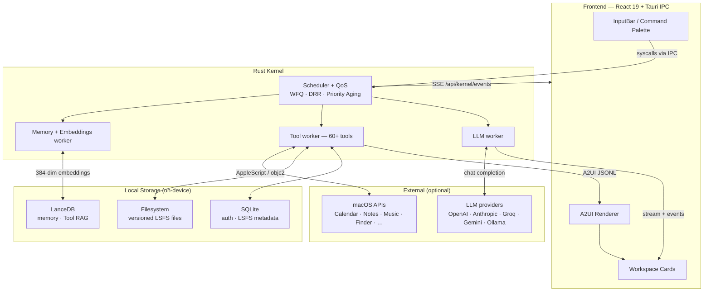
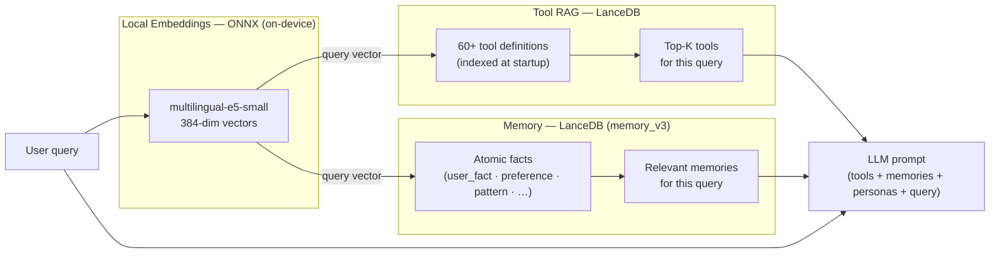
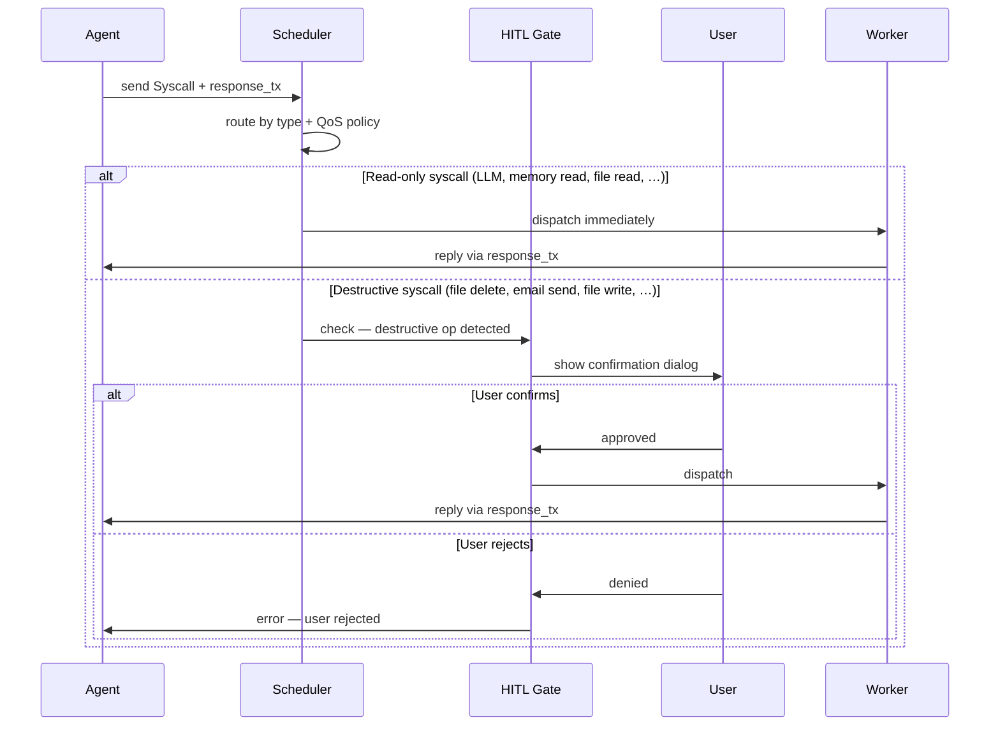
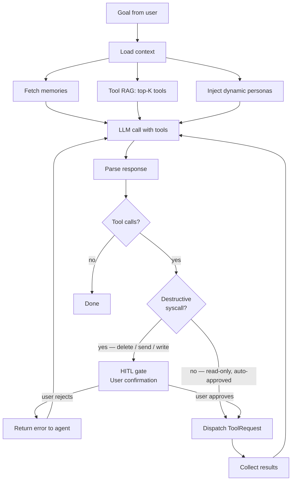
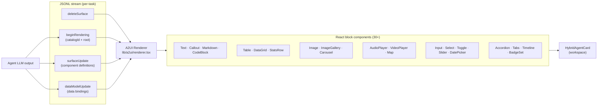
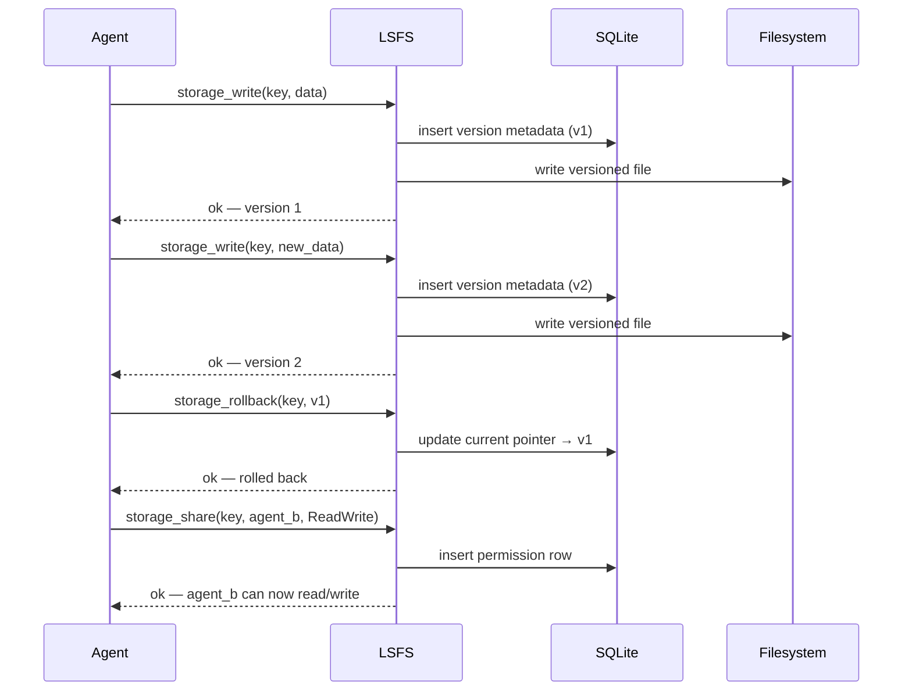
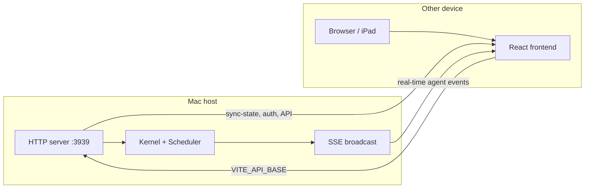

# Synthesis OS


SynthesisOS is an **AI-native operating system layer** — not a chat UI, not an assistant with plugins. Your requests become *syscalls* dispatched by a Rust kernel, executed by autonomous agents with access to 60+ native macOS tools, and rendered as a spatial, glassmorphic workspace.

**The OS itself is the AI.** It reads your emails, manages files, controls apps, searches the web, and executes any action you request.

> **Alpha software.** Actively developed. Architecture and APIs may change without notice.

---




---

## What makes it different

| Principle | What it means |
|---|---|
| **Anti-browser** | No iframes. Web pages are digested by backend agents (Tauri Webview + Readability) and rendered as native glassmorphic cards |
| **Syscall interface** | Every agent action is a typed syscall routed by a scheduler — explicit, auditable, and composable |
| **Local-first** | Kernel, memory, embeddings, and scheduling run on-device. Nothing leaves unless you call an external LLM |
| **Action-first** | You don't visit websites — you command. "Show my last email" reads Apple Mail. "Play some jazz" controls Music.app |
| **Dual mode** | **Zen** (default): minimal single input, clean glass cards. **God**: flip any card to reveal raw JSON, sources, and agent logs |
| **Never refuse** | If a tool exists, the agent uses it. Destructive actions are gated by HITL confirmation — not rejected |

---

## Key capabilities

| Capability | Description |
| --- | --- |
| **Rust kernel + syscall scheduler** | Agents send typed syscalls (LLM, tool, memory, storage, context). Scheduler routes and executes with QoS fairness |
| **Advanced scheduler QoS** | Weighted Fair Queuing, Deficit Round Robin, Priority with Aging — per-agent fairness tracking and backpressure |
| **60+ native tools** | Files, calendar, notes, reminders, contacts, clipboard, music, Finder, Safari, web search, HTTP, TTS, screenshots, and more |
| **Local embeddings (on-device)** | `multilingual-e5-small` via ONNX Runtime — no cloud calls for memory retrieval or tool selection |
| **Tool RAG** | Semantic search over tool definitions; agents receive only the top-K relevant tools per query |
| **Dynamic personas** | Per-query context fragments injected into the prompt; replaces rigid specialist routing |
| **Memory v3 (atomic facts)** | LanceDB-backed atomic facts with 384-dim local embeddings, semantic search, and per-category tagging |
| **Versioned storage (LSFS)** | SQLite + filesystem with auto-versioning, rollback to any version, and agent-to-agent file sharing with permissions |
| **Token-aware context management** | Token budget tracking, context compaction (summarization of old turns), checkpoint/restore per agent |
| **Human-in-the-loop (HITL)** | Destructive syscalls (delete files, send emails, write to disk) are hardcoded to require explicit user confirmation — not a setting, baked into the kernel |
| **Tool approval policy engine** | 100+ tools individually configurable: approval required, audit logging, rate limits per task, domain allowlist for HTTP |
| **Desktop takeover (Jarvis mode)** | Hides desktop icons and Dock; turns the Mac into a full-screen OS interface |
| **Semantic terminal** | Natural language file commands (`create file X`, `rollback`, `list versions`) with LLM fallback for unknown commands |
| **Cross-device with SSE** | Backend on port 3939; remote clients receive real-time agent progress via Server-Sent Events |
| **Multi-user + roles** | JWT auth with SuperAdmin, Admin, and Guest roles; impersonation support |
| **Plugin system (Phase A)** | Extensibility framework for custom node types, tools, providers, widgets, and commands |
| **3D spatial UI** | Three.js (R3F) backdrop, glassmorphic cards (liquid-glass-react), Framer Motion physics animations |
| **A2UI protocol (v0.9)** | Agents return structured UI, not text — [A2UI open standard](https://a2ui.org), 30+ native block components (tables, galleries, media players, interactive inputs, maps…) |
| **Multiple LLM providers** | OpenAI, Anthropic, Groq, Gemini, Ollama — switchable in settings |



---

## Privacy

SynthesisOS is designed to keep your data local by default:

- **Embeddings run on-device** via ONNX Runtime (`multilingual-e5-small`). Memory retrieval and tool selection never require a cloud call.
- **Memory (LanceDB)** lives in your app data directory. No syncing to external services.
- **API keys** are stored in Tauri's local app store, not transmitted unless you explicitly use a cloud LLM provider.
- **Cross-device sync** (optional) sends your workspace and settings to other devices on your LAN — never to a third-party server.
- The scheduler is the single point of control: every tool call is explicit and auditable.

---

## Architecture

High-level flow: **Frontend (React)** → **Tauri (IPC)** → **Kernel (Rust)**. The kernel runs a single **scheduler** that receives **syscalls** from agents and routes them to **LLM**, **tool**, or **memory** workers.

### System overview



### Memory and Tool RAG

Both memory retrieval and tool selection are powered by the same local embedding model — no cloud calls required.



### Syscall lifecycle

Every agent request goes through the same path: the agent sends a **Syscall** into the single channel; the scheduler routes by type and checks the HITL gate for destructive operations before dispatching to a worker.



### Agent ReAct loop



### A2UI rendering pipeline

Agents emit structured JSONL; the renderer maps each message to a React component using the SynthesisOS catalog.



---

## Module reference

### 1. Kernel core (`crates/kernel/src/`)

- **`lib.rs`** — Defines `KernelState` (syscall channel, spatial positions, stats, HTTP client, node registry), `SpatialPosition`, and `NodeSummary`. All kernel modules are re-exported here.
- **`syscall.rs`** — Syscall types: `LlmRequest`, `LlmBatchRequest`, `GetToolDefinitions`, `ToolRequest`, `ToolRetrieve`, memory operations (read/write/append/retrieve/evolve/archive), storage (LSFS: create/read/write/list/delete/rollback/share/versions), context operations (create/compact/save/restore), and `HealthCheck`. Each syscall carries an optional `response_tx` (oneshot) for the reply.
- **`scheduler.rs`** — Central loop. Receives syscalls from a single channel and fans out to three workers (LLM, tool, memory). Holds the `ToolManager`, registers all native tools, and starts the HTTP server.
- **`scheduler_qos.rs`** — Advanced QoS scheduling: **Weighted Fair Queuing**, **Deficit Round Robin**, **Priority with Aging**. Per-agent fairness tracking, backpressure signals, and starvation prevention. Syscall metrics track `waiting_ms` and `execution_ms` per call.

Agents never call tools or LLMs directly; they send syscalls. The scheduler serializes and routes them, so the kernel remains the single point of control.

### 2. Agents and ReAct loop (`agent.rs`, `agent_runtime.rs`)

- **`agent.rs`** — `BaseAgent` and `SynthesisAgent`. `BaseAgent` implements the main ReAct loop: fetch relevant memories and tool set (via Tool RAG), then loop: LLM call → parse tool calls → send `ToolRequest` syscalls → feed results back to LLM until done. Supports "OS chat" mode (conversational, no cards) and optional user approval steps.
- **`agent_runtime.rs`** — Helpers and shared runtime logic for agent execution.
- **`personas.rs`** — Dynamic persona system. Instead of routing to fixed specialists, per-query context fragments are injected into the system prompt based on keyword triggers. 10+ personas: `macos_apps`, `system_control`, `web_research`, `file_ops`, `knowledge`, `data_analysis`, and more. Each persona declares its relevant tools and prompt fragment.

Agents receive conversation history, node summaries (spatial workspace context), and user context. Tool RAG (`tool_rag.rs`) returns the top-K tool names so the prompt only lists relevant tools.

### 3. Tools and safety (`tools.rs`, VFS, macOS bridges, `policy.ts`)

- **`tools.rs`** — Implements the `Tool` trait for 60+ tools across categories: web/research, macOS apps, knowledge/utilities, system control, spatial, versioned storage (LSFS), and real-disk file operations. Each tool is registered in the scheduler's `ToolManager`.
- **HITL gate (kernel-level)** — Before executing any destructive `ToolRequest` syscall (file delete, email send, disk write, etc.), the scheduler suspends the agent and surfaces a confirmation dialog. The user must explicitly approve; rejection returns an error to the agent. This is hardcoded for Alpha — it cannot be disabled via settings.
- **`lib/agent/policy.ts`** — Frontend-side tool approval policy engine (complementary to the kernel HITL gate). Each of the 100+ tools is individually configurable: additional approval prompts, audit logging, rate limits per task, domain allowlist for `http_request`.
- **VFS** — `VirtualFileSystem` in `tools.rs` restricts `read_file` to a sandbox directory. Real-disk access uses separate tools (`file_read_full`, `file_write`) with explicit guards.
- **macOS** — Tools use `commands::macos` (AppleScript/JXA) and `commands/applescript.rs` for native app control. Calendar is integrated via EventKit and `objc2-event-kit` bindings.

**Tool categories:**

| Category | Tools |
| --- | --- |
| Web / Research | `web_search`, `read_page`, `web_scrape`, `http_request`, `summarize_url`, `youtube_search`, `rss_reader`, `search_images` |
| macOS Apps | `email_list`, `notes_*`, `calendar_*`, `reminders_*`, `contacts_search`, `music_*`, `finder_*`, `safari_tabs`, `open_app`, `notify` |
| System Control | `clipboard_read/write`, `set_volume`, `set_brightness`, `toggle_dark_mode`, `get_battery`, `get_wifi`, `say_tts`, `take_screenshot`, `search_files`, `set_timer` |
| Knowledge | `weather`, `currency_convert`, `define_word`, `translate`, `calculate`, `current_time`, `get_system_info`, `qr_code` |
| Storage (LSFS) | `storage_read/write/create/list/delete/rollback/versions` |
| File System | `file_read_full`, `file_write`, `file_append`, `file_move`, `file_copy`, `dir_list` |
| Spatial / Context | `get_spatial_bounds`, `get_node_content` |

### 4. Memory and embeddings (`memory.rs`, `memory_ext.rs`, `local_embeddings.rs`)

- **`memory.rs`** — `MemoryManager` stores **atomic facts** in LanceDB (`memory_v3` table): id, agent_id, key, content, category, timestamps, and a 384-dim embedding. Supports insert, semantic vector search, and update. A RAM cache handles hot key lookups without disk access.
- **`memory_ext.rs`** — Types: `MemoryCategory` (user_fact, preference, os_insight, pattern, conversation), `MemoryEntry`, `MemoryQuery`, `MemoryResponse`.
- **`local_embeddings.rs`** — Generates embeddings on the host using `multilingual-e5-small` via ONNX Runtime. Asymmetric embedding (passages vs queries). Runs as a global singleton; no cloud calls required.

### 5. Versioned storage (`storage.rs`)

- **`storage.rs`** — LSFS (Layered Storage File System): SQLite metadata + filesystem. Every write auto-creates a new version. Features: rollback to any version, version history queries, agent-to-agent file sharing with explicit `Read`, `Write`, or `ReadWrite` permissions. Used by `storage_*` tools.
- **`terminal.rs`** — Semantic terminal. Translates natural language commands (`"create file X with content Y"`, `"show versions of Z"`, `"rollback to version 3"`) into storage operations. Falls back to LLM interpretation for unknown commands.

**LSFS versioning lifecycle:**



### 6. Token-aware context management (`context.rs`)

- **`context.rs`** — `ContextManager` tracks a `TokenBudget` per agent. When the conversation window grows, old turns are compacted (summarized) to stay within budget. Supports checkpoint creation and restore for fault recovery. Contexts are isolated per agent.

### 7. LLM core (`llm_core/`)

- **`adapter.rs`** — Dispatches LLM requests by provider: `openai`, `anthropic`, `groq`, `gemini`/`google`, `ollama`. Handles chat completion and streaming. `LlmBatchRequest` syscall enables parallel LLM calls for plan-and-execute strategies.
- **`types.rs`** — Common request/response types across providers.

### 8. HTTP server, cross-device, and SSE (`http_server.rs`, `events_broadcast.rs`)

- **`http_server.rs`** — Axum server on `0.0.0.0:3939`. Routes: `/api/auth/login`, `/api/auth/setup`, `/api/user/sync-state`, `/api/kernel/events` (SSE), `/api/health`. JWT auth middleware. Optional impersonation for SuperAdmin. CORS enabled. TLS support via `SYNTHESIS_HTTPS_CERT`/`SYNTHESIS_HTTPS_KEY` env vars (required for Safari/iOS cross-device).
- **`events_broadcast.rs`** — `KernelEvent` broadcast channel. Agent progress (steps, tool results, streaming reasoning) is pushed to remote clients in real time via Server-Sent Events — not just workspace sync on login.
- **Cross-device:** Same backend serves the local Tauri app and any remote browser. Point `VITE_API_BASE` at the Mac's IP to load workspace, settings, and receive live agent events from another device.

### 9. Desktop takeover (`desktop_takeover.rs`)

- **`desktop_takeover.rs`** — "Jarvis mode". Exposes commands to hide and restore macOS desktop icons, auto-hide/show the Dock, and enter a fullscreen OS takeover. Restores state on quit.

### 10. Auth and multi-user (`auth.rs`)

- **`auth.rs`** — `AuthManager` with SQLite `users` table. Argon2 password hashing. JWT generation and validation. Roles: **SuperAdmin**, **Admin**, **Guest**. Token expiry. Impersonation: a SuperAdmin can act as any user via the `X-Impersonate-User` header.

### 11. Other kernel modules

- **`tool_rag.rs`** — Semantic search over tool definitions via LanceDB + local embeddings. Returns top-K tools per query. Always includes `notify`, `web_search`, `read_page`.
- **`tool_cache.rs`** — LRU/TTL cache for tool responses. Prevents duplicate API calls within a cache window.
- **`prompts.rs`** — System and user prompt templates for agents.
- **`settings.rs`** — Kernel settings: LLM provider config, QoS policy, memory settings, tool approval flags. Loaded from Tauri store.

### 12. Frontend (React + Tauri)

- **`apps/desktop/src/App.tsx`** — Root layout: menu bar, spaces, dock, input bar, command palette, settings, generative zone, recall view, chat panel, onboarding, profile unlock, Jarvis button.
- **`apps/desktop/src/components/synthesis-ui/`** — Core UI: `InputBar`, `WorkspaceView`, `SpaceDock`, `MenuBar`, `SettingsView`, `CommandPalette`, `GenerativeZone`, `RecallView`, `ChatPanel`, `HolographicHUD`, `SpatialBackdrop3D`, onboarding wizard, login, profile selector.
- **`apps/desktop/src/components/a2ui-components/`** — 30+ block components implementing the [A2UI open standard](https://a2ui.org) (v0.9 compatible): tables, code blocks, image galleries, audio/video players, maps, timelines, accordions, stat rows, carousels, data grids, interactive inputs, and more. The renderer (`lib/a2ui/renderer.tsx`) consumes JSONL streams (`surfaceUpdate`, `dataModelUpdate`, `beginRendering`, `deleteSurface`) and maps them to React components via the SynthesisOS catalog.
- **`apps/desktop/src/lib/agent/policy.ts`** — Tool approval policy engine (frontend): per-tool approval config, rate limits, domain allowlists, audit log entries.
- **`apps/desktop/src/lib/plugins/registry.ts`** — Plugin system skeleton (Phase A). Extensible via `SynthesisPlugin` interface. Supports registering custom: node types, tools, LLM providers, widgets, commands. Sandboxed execution planned for Phase C.
- **`apps/desktop/src/hooks/useUserSyncState.ts`** — Cross-device session sync. Loads full settings + workspace from the Mac on login. Persists changes with debouncing. Flushes on visibility change and `pagehide` for reliable sync.
- **`apps/desktop/src/lib/client/synthesisRunner.ts`** — Calls Tauri `submit_synthesis_task` and listens for `synthesis-progress`, `synthesis-complete`, `synthesis-error` events.
- **`apps/desktop/src/lib/client/agentRunner.ts`** — Calls `submit_agent_task`, consumes the event stream as an `AsyncGenerator`.

State is persisted (workspace, nodes, settings) via IndexedDB and can be synced from the backend over the HTTP API.

---

## Getting started

### Prerequisites

- **macOS** (primary target; many tools use AppleScript/JXA and native objc2 bindings).
- **Node.js** (v18+; v20 recommended) and npm.
- **Rust** toolchain (`rustup`). The Tauri CLI is installed via npm.
- At least one **LLM API key** (OpenAI, Anthropic, Groq, or Gemini) or a local **Ollama** instance.

### Install and run

```bash
cd apps/desktop
npm install
npm run dev:tauri
```

This builds the Rust kernel, starts the Vite dev server, and opens the Tauri window. For frontend-only development (no native features): `npm run dev`.

### Build for production

```bash
cd apps/desktop
npm run build:tauri
```

Output: `target/release/bundle/` (`.app` or `.dmg`).

### Scripts

| Script | Description |
| --- | --- |
| `npm run dev` | Vite dev server (frontend only) |
| `npm run dev:lan` | Vite + HTTPS with `--host` (LAN access) |
| `npm run dev:tauri` | Tauri + Vite (full app, Rust kernel + UI) |
| `npm run build` | TypeScript check + Vite production build |
| `npm run build:tauri` | Release build of the desktop app (.app/.dmg) |
| `npm run lint` | ESLint |
| `npm run test` | Vitest (run once) |
| `npm run test:watch` | Vitest (watch mode) |

---

## Configuration

### Environment variables

**Frontend** (`apps/desktop/.env` or `apps/desktop/.env.local`):

| Variable | Description |
| --- | --- |
| `VITE_API_BASE` | Backend URL for cross-device (e.g. `http://192.168.1.x:3939`) |

**Backend** (`apps/desktop/src-tauri/.env`):

| Variable | Description |
| --- | --- |
| `OPENAI_API_KEY` | Optional if set in-app |
| `ANTHROPIC_API_KEY` | Optional if set in-app |
| `GROQ_API_KEY` | Optional if set in-app |
| `GEMINI_API_KEY` | Optional if set in-app |
| `SYNTHESIS_HTTPS_CERT` | Path to `cert.pem` — required for Safari/iOS cross-device (TLS) |
| `SYNTHESIS_HTTPS_KEY` | Path to `key.pem` — required for Safari/iOS cross-device (TLS) |

### In-app settings

Use the settings UI to choose provider/model, configure tool approval policies, toggle agent mode, adjust memory settings, and more. Stored in Tauri's local app store and synced via `/api/user/sync-state` when using the HTTP API.

---

## Cross-device usage

The backend runs on your Mac and listens on port **3939**. From another device on the same network, the full workspace and live agent events are available.



1. Set `VITE_API_BASE=http://<MAC_IP>:3939` in `apps/desktop/.env` on the other device.
2. For Safari/iOS: generate a self-signed cert (`mkcert` or `openssl`) and set `SYNTHESIS_HTTPS_CERT` / `SYNTHESIS_HTTPS_KEY`. See [docs/cross-device.md](docs/cross-device.md) for details.
3. From `apps/desktop/`, run `npm run dev` or `npm run dev:lan` and open in the browser.
4. Log in. The app loads workspace and settings from the Mac via `GET /api/user/sync-state`, then subscribes to `GET /api/kernel/events` for real-time agent progress.

If the connection fails, the UI shows a "Could not load workspace" message and a retry button.

---

## Tech stack

| Layer | Technology |
| --- | --- |
| App frame | Tauri v2 (Rust, macOS private API) |
| Frontend | React 19, Vite 6, TypeScript (strict) |
| Styling | Tailwind CSS, Framer Motion, Three.js (R3F), liquid-glass-react |
| State | Zustand, React Context, IndexedDB, localStorage |
| Kernel | Rust (tokio async runtime) |
| LLM clients | async-openai 0.33; Anthropic, Groq, Gemini, Ollama adapters |
| Embeddings | ONNX Runtime (`ort` 2.0), `multilingual-e5-small` (on-device) |
| Vector DB | LanceDB 0.10 (memory + Tool RAG) |
| Relational DB | SQLite via `rusqlite` (auth, LSFS metadata) |
| HTTP server | Axum 0.7 + axum-server (REST + SSE) |
| Auth | JWT (`jsonwebtoken`), Argon2 password hashing |
| macOS native | `objc2`, `objc2-event-kit`, `objc2-foundation`, `objc2-core-graphics` |
| Icons | Lucide React |

---

## Status and roadmap

- **Current state:** Alpha. Actively developed; APIs and data formats may change without notice.
- **Not production-hardened:** Avoid storing highly sensitive secrets until the security model is fully audited.
- **Roadmap:** Stabilize scheduler and tool set, improve onboarding, wire plugin system (Phase B/C), add more LLM providers, expand platform support.

---

## Contributing

Contributions are welcome. Please open an issue first for large or breaking changes. For small fixes or docs, a direct pull request is fine.

- **Issues:** Bug reports, feature ideas, or questions.
- **Pull requests:** Target the default branch; keep changes focused and document non-obvious behavior.

---

**Keywords:** `AI Operating System` · `Autonomous Agents` · `Local LLM` · `On-Device AI` · `Rust Kernel` · `Multi-Agent Systems` · `Agentic AI` · `Sovereign AI` · `Privacy-First AI` · `ReAct Loop` · `Desktop AI` · `macOS AI` · `AI Desktop` · `LLM Desktop App` · `Tauri` · `A2UI` · `Tool Use` · `Agent Framework`
